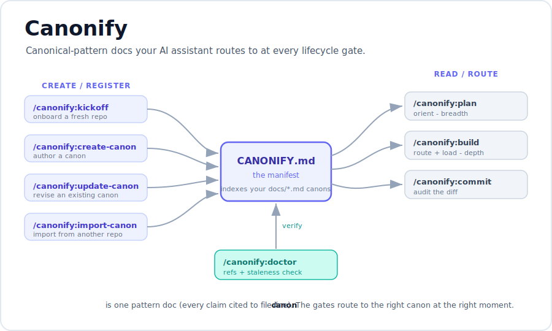
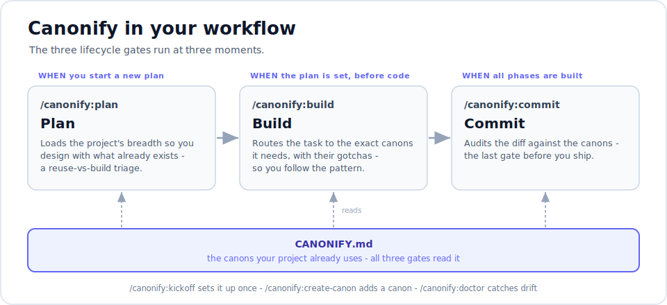

# Canonify

> Canonical-pattern docs your AI assistant routes to at every lifecycle gate.



**Canonify** gives an AI coding assistant the one thing it lacks in a real codebase: a memory of how
*this* project already does things. You capture each pattern as a **canon** - a short markdown doc
with `file:line` references - a `CANONIFY.md` manifest indexes them, and seven skills route to the
right canon at the right moment. The assistant follows your conventions instead of reinventing them.

It is a [Claude Code](https://docs.claude.com/en/docs/claude-code/overview) plugin. **Language-agnostic:**
the gates match prose, not code, so the same skills work on a .NET, Python, Node, or Go repo - only
each repo's canons differ.

## The problem

Drop an AI assistant into a mature codebase and it confidently rebuilds what already exists: a second
HTTP client, a config pattern you abandoned, a form that ignores your validation conventions. Not
because it is wrong - because it cannot see what is *canonical*. Canonify makes that knowledge
explicit and routable.

## Concepts

- **A canon** - one pattern doc (`.md`), every claim cited to `file:line` (e.g. how you call Twilio,
  how you build a data table, how a particular feature works).
- **`CANONIFY.md`** - the manifest: a one-line summary of every canon. The breadth map the gates
  route through.
- **The gates** - seven skills that read or maintain the canon at each point in the lifecycle.

## Why not just put it all in `CLAUDE.md`?

`CLAUDE.md` is loaded into context **every session, in full** - ideal for a short list of always-true project rules. But the moment you try to capture *every* pattern there - how you call each vendor, how you build each UI element, the gotchas in each subsystem - it balloons, and you pay that token cost on every turn whether the task touches those patterns or not. Worse, the guidance that *is* relevant gets buried in everything that isn't.

Canonify is **lazy by design:**

- The manifest (`CANONIFY.md`) holds only a **one-line summary per canon** - a cheap breadth map that stays small even at 100+ patterns, and it is read only when you run a gate, not on every message.
- The **full canon** loads only when a task or diff actually implicates it. You pay for a pattern's detail exactly when you are working on it - not before.

So your per-task context stays roughly constant as the codebase grows, and the model's attention lands on the few patterns that matter instead of wading through all of them.

Keep `CLAUDE.md` for the handful of always-on rules; let Canonify carry the large, growing body of situational patterns.

## The gates

| Gate | Command | What it does |
|---|---|---|
| Kickoff | `/canonify:kickoff` | onboard a fresh repo: survey -> write `CANONIFY.md` + a `docs/` skeleton -> optionally scan-and-seed canons |
| Create-canon | `/canonify:create-canon` | author a new canon from a file / service / element and register it |
| Update-canon | `/canonify:update-canon` | capture a mid-coding discovery into an existing canon: dedup-check, then add or revise |
| Plan | `/canonify:plan` | breadth orientation before planning (reuse-vs-build triage) |
| Build | `/canonify:build` | route a task to the canons it implicates, load them, follow the pattern |
| Commit | `/canonify:commit` | audit a diff against the rules the canons document |
| Doctor | `/canonify:doctor` | health check: reference integrity + git-derived staleness |

## How it fits your workflow



Canonify rides the natural **plan -> build -> commit** rhythm. The three lifecycle gates run at three moments:

1. **Plan** - `/canonify:plan` - **when you start a new plan.** It loads the project's breadth (the one-line summary of every canon in `CANONIFY.md`) so you design with the whole menu in view: which integrations, services, and UI patterns already exist to reuse, and what is genuinely new. You get a reuse-vs-build triage before any architecture is set.

2. **Build** - `/canonify:build` - **once the plan is set, before Claude writes code.** It takes the concrete task and routes it to the specific canons it implicates, loading them in full. The implementation then follows your established patterns - the right wrapper, the right helper, the documented gotchas - instead of a reinvented version.

3. **Commit** - `/canonify:commit` - **after you have built all the phases.** It audits the diff against the rules those same canons document, before you commit or ship - a last gate that catches "this does not follow our convention" before it lands.

The other three gates support the loop rather than sit in it:

- **`/canonify:kickoff`** - run once per repo to set Canonify up.
- **`/canonify:create-canon`** - whenever you build something new worth standardizing, capture it as a canon.
- **`/canonify:update-canon`** - whenever you discover something mid-task that an existing canon should know - it dedup-checks, then adds or revises. `/canonify:commit` also offers it when a diff looks to have outrun a canon.
- **`/canonify:doctor`** - periodically (or on a schedule) to flag canons whose code has drifted.

## What you'd use it for

**Lock in a UI element so it is reused, not re-drawn.**
You build a working chat panel (or data table, or card) in HTML/CSS/JS and get the look and behavior right - a working reference, not necessarily the polished final. Run `/canonify:create-canon` on it and Canonify documents the markup, the classes, the tokens, and a copy-pasteable **mockup recipe**. Now every other screen that needs that element gets the *same* one - and an AI assistant building the next section reproduces it exactly instead of inventing a slightly different variant.

**Standardize how you call a third-party API.**
Wrap Stripe (or Twilio, UPS, ...) once with your conventions - where the config lives, how errors are handled, retries. Canonify it. The next integration follows the same shape, and `/canonify:build` hands that pattern to whoever - or whatever - adds it.

**Onboard a contributor (human or AI) in one command.**
`/canonify:plan` gives a breadth tour of what the codebase already has, so new work reuses instead of reinventing; `/canonify:build` routes a specific task to the exact pattern plus gotchas.

**Catch convention violations before they ship.**
`/canonify:commit` audits a diff against the rules your canons document (for example: "match phone numbers by a normalized key, never string equality") - a guardrail at the last gate before prod.

## Quickstart

```sh
# add this repo as a plugin marketplace
/plugin marketplace add ewebdzine/canonify
/plugin install canonify@canonify

# stand Canonify up in your project
/canonify:kickoff
```

`kickoff` asks a couple of questions, writes your `CANONIFY.md` + `docs/` skeleton, and (optionally)
scans the codebase to draft a first set of canons. From there, `/canonify:create-canon` adds more, and
the lifecycle gates route to them.

## How staleness stays honest

Each canon carries a `verified: <git-sha>` marker - the commit at which it was last confirmed against
the code. `/canonify:doctor` runs `git log <verified>..HEAD` over every file a canon references;
anything that moved since gets flagged for review. No hand-maintained date logs - git holds the dates,
and `/canonify:commit` refreshes the marker when it re-confirms a canon.

## Status

Pre-1.0. All seven gates are built and project-agnostic. The reference implementation is a large
production .NET / Composite C1 codebase (~30 canons across platform, integrations, services, and UI),
and it is running clean in a second, different .NET project - the genericization holds. Next: a
non-.NET stack, then a v1.0 release. See [SPEC.md](SPEC.md) for the feature and release checklist,
and [CHANGELOG.md](CHANGELOG.md) for history.

## License

[MIT](LICENSE).
